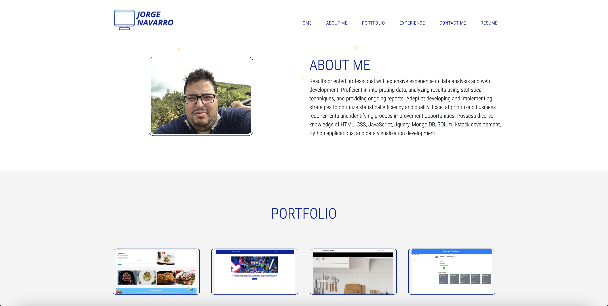

# React Portfolio
UCF Bootcamp Week 20 - REACT Challenge: Portfolio

## Table of Contents

* [Description](#Description)
* [Requirements](#Requirements)
* [Installation](#Installation)
* [Usage](#Usage)
* [License](#License)
* [Badges](#Badges)
* [Issues](#Issues)
* [Technologies](#Technologies)
* [Screenshot](#screenshot)
* [Deployment](#deployment)
* [Contributing](#Contributing)
</br>
</br>

## Description
A place to share your projects not only if you're applying for jobs or working as a freelancer but also so that you can share your work with fellow developers and collaborate on future projects.
<br>
<br>

## Requirements

#### User Story
>AS AN employer looking for candidates with experience building single-page applications. I WANT to view a potential employee's deployed React portfolio of work samples. SO THAT I can assess whether they're a good candidate for an open position
<br>
<br>

>GIVEN a single-page application portfolio for a web developer
<br>
<br>

>WHEN I load the portfolio
>>THEN I am presented with a page containing a header, a section for content, and a footer
<br>

>WHEN I view the header
>>THEN I am presented with the developer's name and navigation with titles corresponding to different sections of the portfolio
<br>

>WHEN I view the navigation titles
>>THEN I am presented with the titles About Me, Portfolio, Contact, and Resume, and the title corresponding to the current section is highlighted
<br>

>WHEN I click on a navigation title
>>THEN I am presented with the corresponding section below the navigation without the page reloading and that title is highlighted
<br>

>WHEN I load the portfolio the first time
>>THEN the About Me title and section are selected by default
<br>

>WHEN I am presented with the About Me section
>>THEN I see a recent photo of the developer and a short bio about them
<br>

>WHEN I am presented with the Portfolio section
>>THEN I see titled images of six of the developer’s applications with links to both the deployed applications and the corresponding GitHub repository
<br>

>WHEN I am presented with the Contact section
>>THEN I see a contact form with fields for a name, an email address, and a message
<br>

>WHEN I move my cursor out of one of the form fields without entering text
>>THEN I receive a notification that this field is required
<br>

>WHEN I enter text into the email address field
>>THEN I receive a notification if I have entered an invalid email address
<br>

>WHEN I am presented with the Resume section
>>THEN I see a link to a downloadable resume and a list of the developer’s proficiencies
<br>

>WHEN I view the footer
>>THEN I am presented with text or icon links to the developer’s GitHub and LinkedIn profiles, and their profile on a third platform (Stack Overflow, Twitter) 
<br>
<br>

## Installation
To use this application, please install: 
```
npm install
```

<br/>
<br/>

## Usage
In order to use the application, run the following commands:
```
npm start
```

<br/>
<br/>

## License 
[](https://opensource.org/licenses/MIT)
</br>
</br>

## Badges


</br>
</br>

## Issues
[](https://GitHub.com/jorgeebn16/react-portfolio/issues/)
[](https://GitHub.com/jorgeebn16/react-portfolio/issues?q=is%3Aissue+is%3Aclosed)
</br>
</br>

## Technologies
* [React](https://reactjs.org//)
* [npm](https://www.npmjs.com/)
* [Fontawesome](https://fontawesome.com/)
* [Emailjs](https://www.emailjs.com/)
* [Icons8](https://icons8.com/icons/)
* [React-popupbox](https://www.npmjs.com/package/react-popupbox)
* [React-hook-form](https://www.npmjs.com/package/react-hook-form)
* [React-particles](https://www.npmjs.com/package/react-particles-js)

<br/>
<br/>

## Screenshot
<br/>


</br>
</br>

## Deployment
View [Deployed Portfolio](https://jorgeebn16-react-portfolio.herokuapp.com/)

## Contributing
[](https://GitHub.com/jorgeebn16/react-portfolio/graphs/contributors/)

For anyone who wishes to contribute you can contact me with at jorgeebn16@gmail.com
</br>
</br>

Would you like to reach me?
</br>
Contact Me:

Github: https://github.com/jorgeebn16</br>
Email: jorgeebn16@gmail.com


## Issues
[](https://GitHub.com/jorgeebn16/react-portfolio/issues/)
[](https://GitHub.com/jorgeebn16/react-portfolio/issues?q=is%3Aissue+is%3Aclosed)

